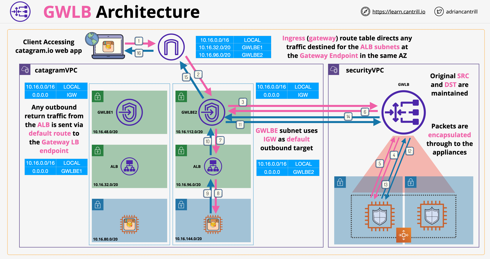

# Gateway Load Balancers (GWLB)

- It is a product to help us run and scale third party security appliances
- This appliances can be firewalls, intrusion detection and prevention systems or even data analysis tools
- We can use these to perform inbound and outbound transparent traffic inspection and protection
- At high level a GWLB has to major components:
    - GWLB endpoints: run from a VPC where traffic enters/leaves via these endpoints. This are similar to interface endpoints with some key improvements
    - GWLB itself: there are normal EC2 instances running security software
- The GWLB needs to forward traffic without any alteration, the security appliance needs to review packets as they are sent/received
- GWLB use a protocol named GENEVE, this is a traffic and metadata tunneling protocol
- GWLBs are layer 3/4 devices, similar to NLB, but they integrate with GWLB endpoints and they encapsulate all traffic between them and the target using the GENEVE protocol. When the scanning is finished, the traffic is returned on the same tunnel to the GWLB from where, using the GWLB endpoint, it is returned to the intended destination
- GWLB will load balance between security appliances, so we can horizontally scale
- GWLB manage flow stickiness, one flow of data will always use the same appliance
- Ingress route tables:
    - They are placed on the internet gateway
    - They influence what happens with the traffic arriving to the VPC
    - They can redirect traffic to GWLB endpoints
- GWLB architecture:
    